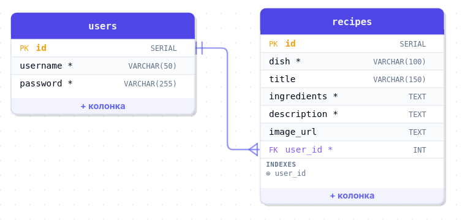
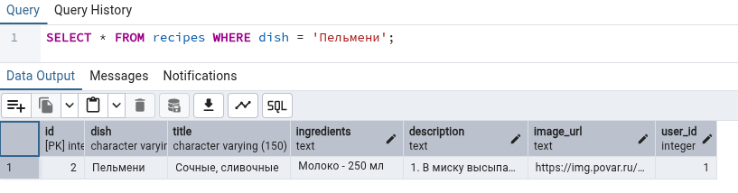
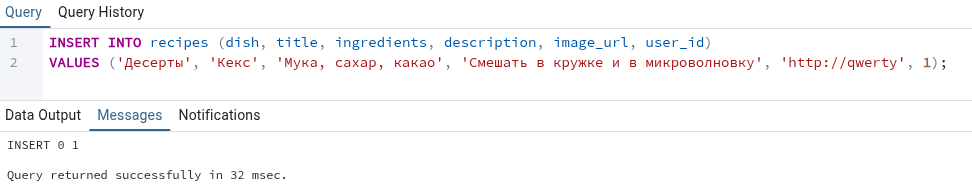
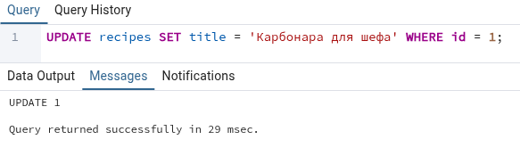
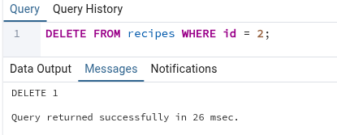
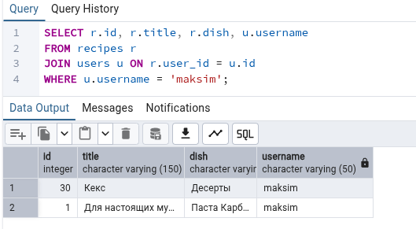

# Recipe-hub

## use-case diagram


## ER-диаграмма



## Интерфейс приложения

| Главная страница         | Модальное окно рецепта                 |
| ------------------------ | -------------------------------------- |
|  |  |

| Конвертер                        | Избранное                        |
| -------------------------------- | -------------------------------- |
|  |  |

| Мобильная версия                         | Модальное окно входа                |
| ---------------------------------------- | ----------------------------------- |
|  |  |

## Инструкция по запуску

> **Важно:** Все команды по установке и запуску необходимо выполнять строго **из
> корневой папки** проекта (`/recipe-hub`). Не нужно переходить в другие
> подпапки.

```bash
# Установка всех зависимостей
npm install

# Запуск фронтенда (Vite)
npm run dev

# Запуск бэкенд-сервера
npm run server
```

### Скрипт базы данных и SQL-запросы

Структура БД и тестовые данные находятся в файле **`init.sql`** в корне
репозитория.

В скрипте проверены все **5 обязательных типов запросов**:

1. **SELECT с WHERE** — поиск рецептов по категории.
2. **INSERT** — добавление рецепта (совместимо с автоинкрементом бэкенда).
3. **UPDATE** — изменение заголовка рецепта по `id`.
4. **DELETE** — удаление записи по `id`.
5. **SELECT с JOIN** — связывание рецепта с автором (`users`) для вывода имени
   создателя.

<details>
<summary><b>Скрины выполнения sql запросов</b></summary>

#### 1. SELECT с условием WHERE



#### 2. INSERT нового рецепта



#### 3. UPDATE заголовка



#### 4. DELETE записи



#### 5. SELECT с JOIN



</details>
