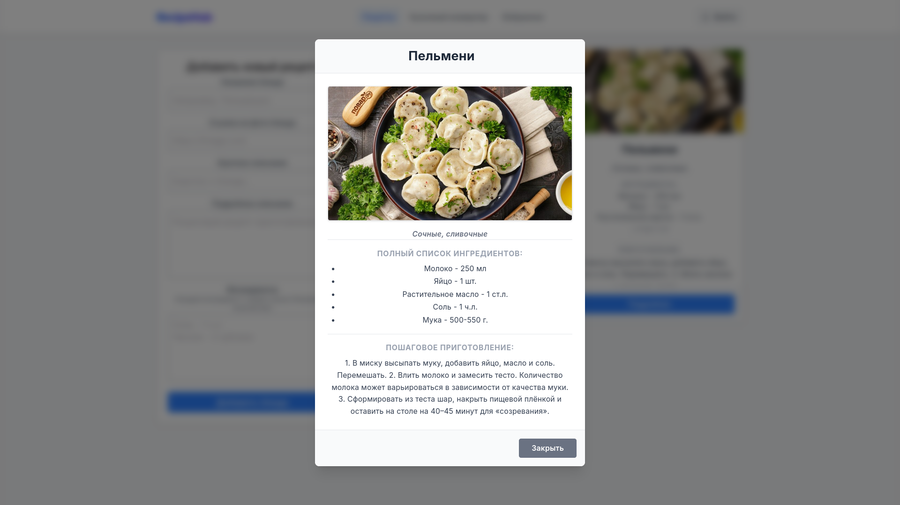
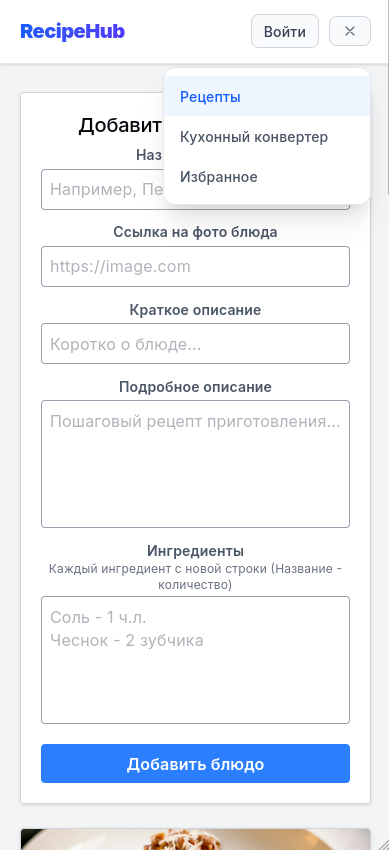
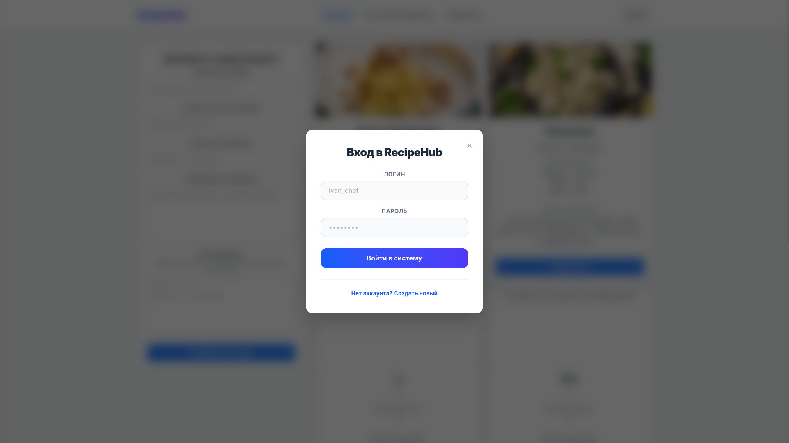

# Recipe-hub

## use-case diagram


## Интерфейс приложения

| Главная страница         | Модальное окно рецепта                 |
| ------------------------ | -------------------------------------- |
|  |  |

| Конвертер                        | Избранное                        |
| -------------------------------- | -------------------------------- |
|  |  |

| Мобильная версия                         | Модальное окно входа                |
| ---------------------------------------- | ----------------------------------- |
|  |  |

## Инструкция по запуску

> **Важно:** Все команды по установке и запуску необходимо выполнять строго **из
> корневой папки** проекта (`/recipe-hub`). Не нужно переходить в другие
> подпапки.

```bash
# Установка всех зависимостей
npm install

# Запуск фронтенда (Vite)
npm run dev

# Запуск бэкенд-сервера
npm run server
```
