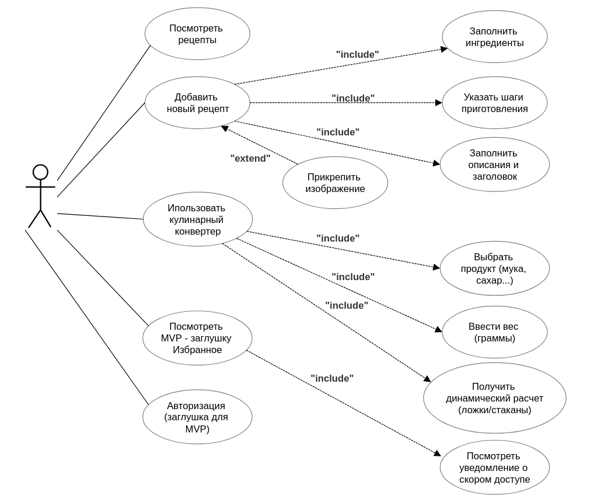
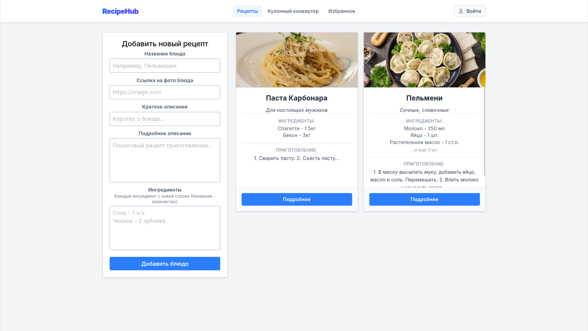
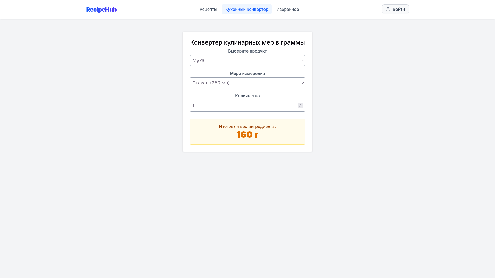
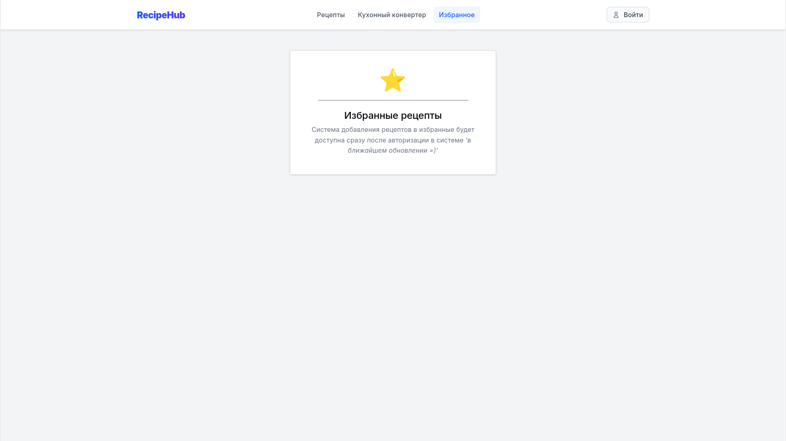

# Recipe-hub



## Интерфейс приложения

### Главная страница / Рецепты



### Модальное окно с подробным описанием рецепта


### Кухонный конвертер



### Раздел Избранное



## Инструкция по запуску

```bash
# Установка всех зависимостей
npm install

# Запуск бэкенд-сервера
npm run server

# Запуск фронтенда (Vite)
npm run dev
```
